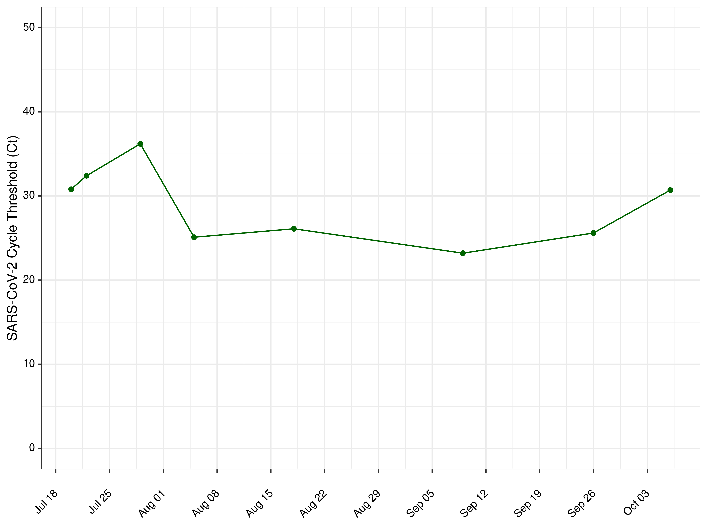
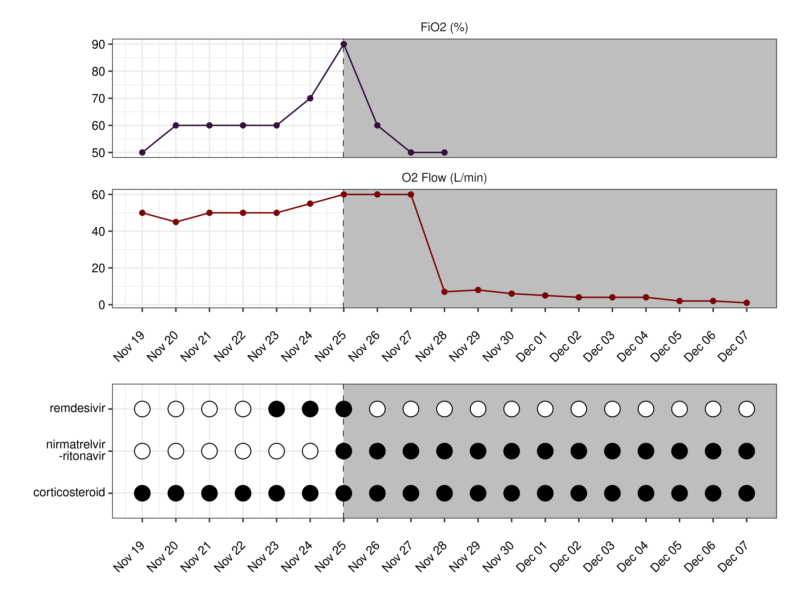

exclude: true

```{r setup, include=FALSE, echo=FALSE, message=FALSE, error=FALSE, include=FALSE, comment=FALSE}
options(htmltools.dir.version = FALSE)
xaringan::summon_remark()
library(tidyverse)
library(gt)

```

```{r xaringan-tile-view, echo=FALSE, message=FALSE, error=FALSE, include=FALSE, comment=FALSE}
xaringanExtra::use_tile_view()
xaringanExtra::use_webcam()
xaringanExtra::use_tachyons()
xaringanExtra::use_animate_css()
xaringanExtra::use_share_again()
#xaringanExtra::use_scribble(pen_color = "#56106E")
```

---
class: top left hide-count
background-image: url(img/sarscov2_cdc_blur_crop.png)
background-size: cover

.move-top20[
.title-text[<span style='font-size:1.0em'>COVID-19</span>]  
.title-subtext[<span style='font-size:1.0em'>A Case of Prolonged Infection<br> & Organizing Pneumonia</span>]  
]  
  
.callout-url-leftcorner[
.title-nametext[
Brendan J. Kelly, MD, MS  
Infectious Diseases, Epidemiology & Microbiology  
University of Pennsylvania  
`r format(Sys.Date(), '%d %B %Y')`   
]
]

.footnote-right[<span style='color: white'>photo: CDC @unsplash</span>]  


---
exclude: true

## Disclosures  

.pad-left[  

- No conflicts of interest.  

- Research supported by:

    - NIAID K23 AI121485  
    
    - CDC BAA 200-2021-10986   

]


---

## History of Present Illness        
  
.pad-left[  
  
- __Demographics and Past History__:    
  
    - mantle cell lymphoma  
    
    - present  
    
- __Present Illness__:     
  
    -  organizing pneumonia on chronic steroids and home O2  
    
    - recent monoclonal and baricitinib with good clinical response
  
]  

  
  
---

## Previous COVID-19 Treatment        
  
.pad-left[  
  
- __Antiviral__:    
  
    - mantle cell lymphoma  
    
    - present  
    
- __Organizing Pneumonia__:     
  
    -  organizing pneumonia on chronic steroids and home O2  
    
    - recent monoclonal and baricitinib with good clinical response
  
]  

  
  
---

## Chest Imaging:         
  
.center[
```{r chest1, echo=FALSE, message=FALSE, error=FALSE, comment=FALSE, eval=TRUE, autodep=TRUE, fig.align='center', out.height='80%'}
#knitr::include_graphics("img/chest_ct1.png")
```
]


  
  
---

## Chest Imaging:         
  
.center[
```{r chest2, echo=FALSE, message=FALSE, error=FALSE, comment=FALSE, eval=TRUE, autodep=TRUE, fig.align='center', out.height='80%'}
#knitr::include_graphics("img/chest_ct2.png")
```
]


  
  
---
background-image: url("figs/p_ct.png")
background-position: center
background-size: contain


---
exclude: true

## SARS-CoV-2 Ct Values Over Time        
  
.center[
```{r ct_series, echo=FALSE, message=FALSE, error=FALSE, comment=FALSE, eval=TRUE, autodep=TRUE, fig.align='center', out.height='80%'}

```
]


  
  
---

## A Recent Case Report        
  
.pad-left[  
  
-   
  
]  

.footnote-left[[Najjar-Debbiny R et al _CID_ 2022](https://academic.oup.com/cid/advance-article/doi/10.1093/cid/ciac443/6599020); [Ford ES et al _CID_ 2022](https://academic.oup.com/cid/advance-article/doi/10.1093/cid/ciac868/6795102)]  
  
  
  
---
exclude: true

## Najjar-Debbiny et al _CID_ 2022        
  
.center[
```{r najjar_debbiny, echo=FALSE, message=FALSE, error=FALSE, comment=FALSE, eval=TRUE, autodep=TRUE, fig.align='center', out.height='80%'}
#knitr::include_url("https://academic.oup.com/cid/advance-article/doi/10.1093/cid/ciac443/6599020")
```
]

  
.footnote-left[[Najjar-Debbiny R et al _CID_ 2022](https://academic.oup.com/cid/advance-article/doi/10.1093/cid/ciac443/6599020)]  


  
---
exclude: true

## Ford et al _CID_ 2022          
  
.center[
```{r ford, echo=FALSE, message=FALSE, error=FALSE, comment=FALSE, eval=TRUE, autodep=TRUE, fig.align='center', out.width='95%'}
#knitr::include_url("https://academic.oup.com/cid/advance-article/doi/10.1093/cid/ciac868/6795102")
```
]

  
.footnote-left[[Ford ES et al _CID_ 2022](https://academic.oup.com/cid/advance-article/doi/10.1093/cid/ciac868/6795102)]  


  
---
  
## Single-Patient IND    
  
.pad-left[  

- EUA restricts nirmatrelvir-ritonavir to outpatients without severe disease 
  
- Thanks to Aasith Villavicencio Paz, MD & Jessica Phung, PharmD
  
- Thanks to Meghan Gattie, PharmD @ FDA     

- IND #164918
    
]  


  
  
---
background-image: url("figs/p_combined.png")
background-position: center
background-size: contain


---
exclude: true

## Nirmatrelvir-Ritonavir        
  
.center[
```{r time_series, echo=FALSE, message=FALSE, error=FALSE, comment=FALSE, eval=TRUE, autodep=TRUE, fig.align='center', out.height='80%'}

```
]

  

  
---
exclude: true

## Acknowledgements    

.pull-left[
- __ARES Group @ Penn__
Laurel Glaser, Kyle Rodino, Sean Loughrey, Laura Cowden,   
Magda Wernovsky, Jessie Gunoskey, Jennifer Han, Erik Clarke, Michael David,
Matt Ziegler, Lauren Dutcher, Ebbing Lautenbach, Jim Harrigan  

- __Bushman Laboratory @ Penn__
Arwa Abbas, Aoife Roche, Andrew Marques,
Aubrey Bailey, John Everett,
Rick Bushman

- __PennCHOP Microbiome Program__
Lisa Mattei, Casey Hofstaedter, Huanjia Zhang, Kyle Bittinger

]


.pull-right[
- __Collman Laboratory @ Penn__
Ize Imai, Aurea Simon Soro, John McGinniss, Ron Collman

- __Division of ID @ Penn__
Ian Frank, Pablo Tebas, Robert Gross, Emily Blumberg

- __Rutgers University & Penn DBEI__
Jason Roy, Arman Oganisian
  
- __CDC Prevention Epicenters__
Clifford McDonald, Alison Laufer Halpin
  
- __Funding__
<u>CDC</u>: BAAs 200-2016-91964, 200-2018-02919, 200-2021-10986,
200-2021-10986 & <u>NIAID</u>: K23 AI121485

]

.center[
### brendank@pennmedicine.upenn.edu
]


---
class: middle center hide-count
background-image: url(img/sarscov2_cdc_blur_crop.png)
background-size: cover

.title-subtext[Questions?]


---
exclude: true
class: middle center hide-count
background-image: url(img/sarscov2_cdc_blur_crop.png)
background-size: cover

.title-subtext[Questions?]

.callout-url-bottom[  
.fade-in[<span style="font-size:0.5em; color:white">slides ↓ </span>]  
<span style="link-color:white">[bjklab.org](http://www.bjklab.org)</span>  
]  


