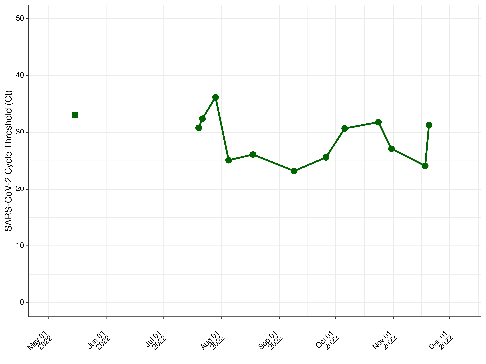
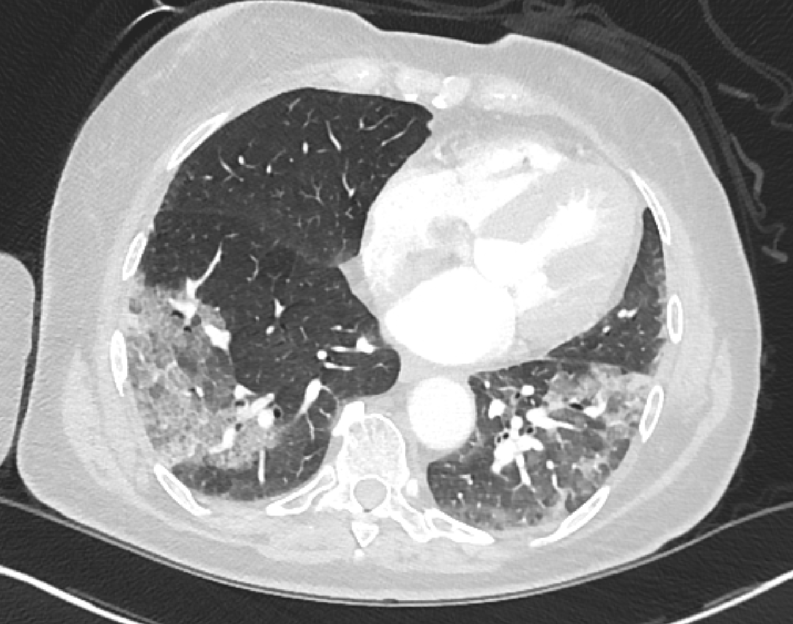
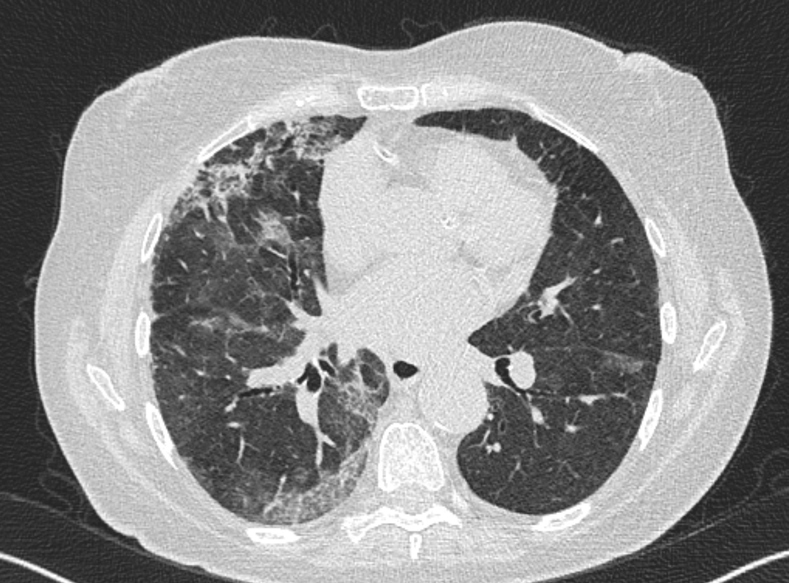
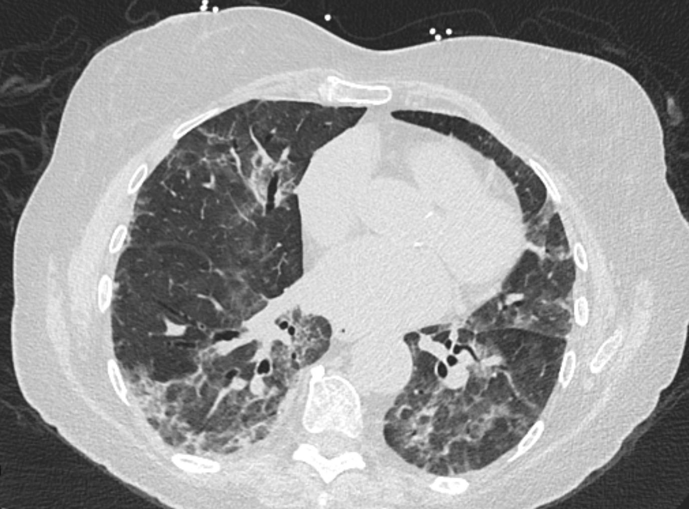
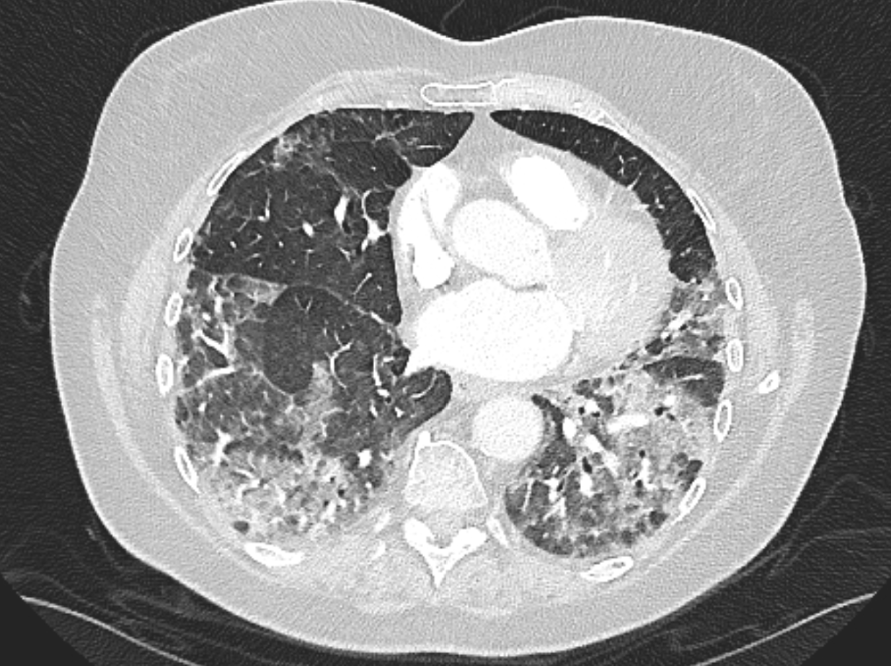
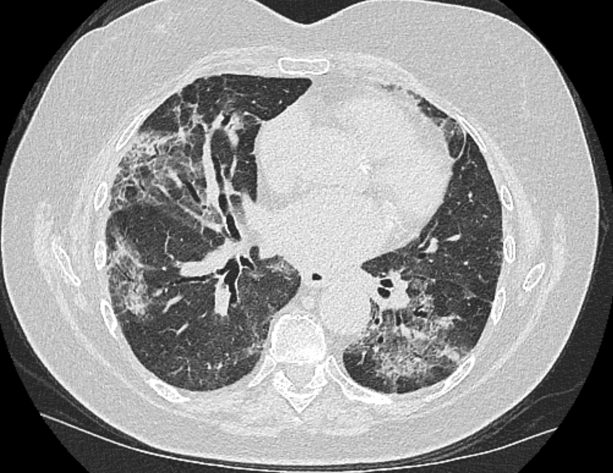
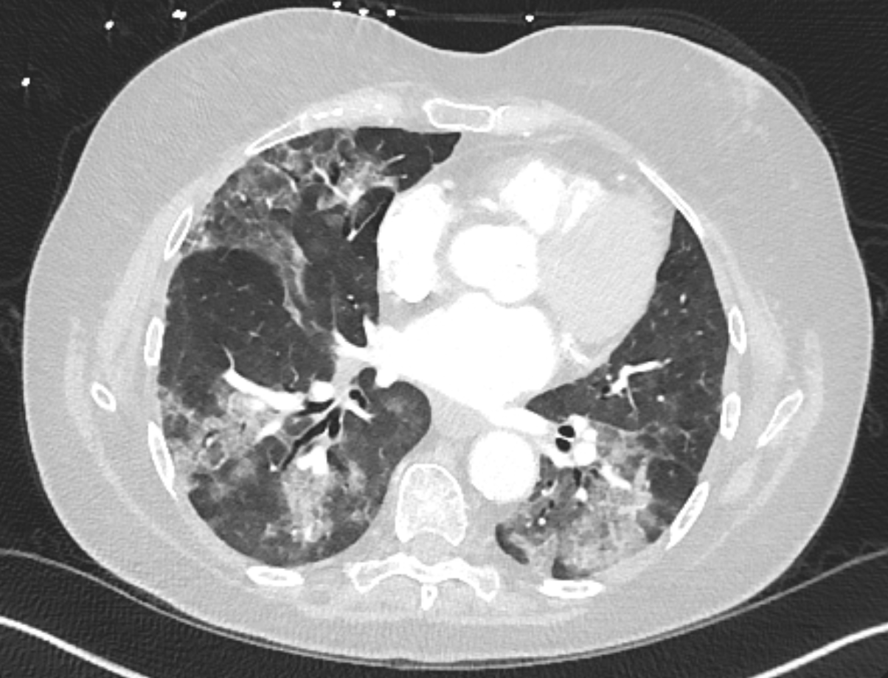
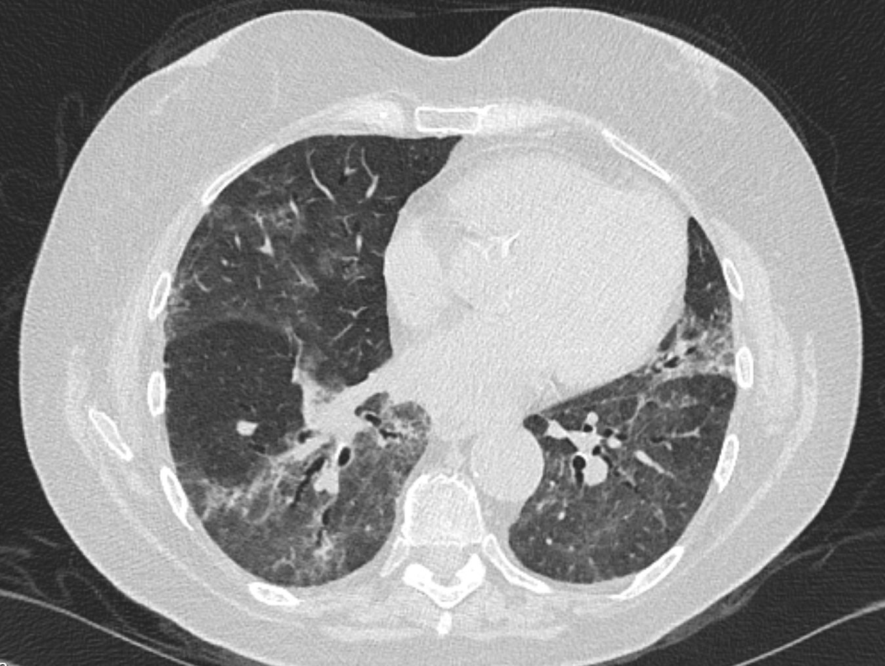

exclude: true

```{r setup, include=FALSE, echo=FALSE, message=FALSE, error=FALSE, include=FALSE, comment=FALSE}
options(htmltools.dir.version = FALSE)
xaringan::summon_remark()
library(tidyverse)
library(gt)

```

```{r xaringan-tile-view, echo=FALSE, message=FALSE, error=FALSE, include=FALSE, comment=FALSE}
xaringanExtra::use_tile_view()
xaringanExtra::use_webcam()
xaringanExtra::use_tachyons()
xaringanExtra::use_animate_css()
xaringanExtra::use_share_again()
#xaringanExtra::use_scribble(pen_color = "#56106E")
```

---
class: top left hide-count
background-image: url(img/sarscov2_cdc_blur_crop.png)
background-size: cover

.move-top20[
.title-text[<span style='font-size:1.0em'>COVID-19</span>]  
.title-subtext[<span style='font-size:1.0em'>A Case of Prolonged Infection<br> & Organizing Pneumonia</span>]  
]  
  
.callout-url-leftcorner[
.title-nametext[
Brendan J. Kelly, MD, MS  
Infectious Diseases, Epidemiology & Microbiology  
University of Pennsylvania  
`r format(Sys.Date(), '%d %B %Y')`   
]
]

.footnote-right[<span style='color: white'>photo: CDC @unsplash</span>]  


---
exclude: true

## Disclosures  

.pad-left[  

- No conflicts of interest.  

- Research supported by:

    - NIAID K23 AI121485  
    
    - CDC BAA 200-2021-10986   

]


---

## History of Present Illness        
  
.pad-left[  
  
- 74yo W with hypothyroidism, mantle cell lymphoma s/p obinutuzumab/zanubrutinib (anti-CD20 / tyrosine-kinase inhibitor) admitted with COVID-19 and organizing pneumonia   
  
- Reportedly SARS-CoV-2 positive since May 2022 despite COVID vaccine * 4  

- Presented July 2022 with fevers, hypoxia, bilateral groundglass opacities

- Concern for drug-induced organizing pneumonia / pneumonitis  
    
- Held zanubrutinib; started high-dose prednisone, home O2, T/S ppx July 2022  
    
]  

  
  
---

## History of Present Illness        
  
.pad-left[  
  
- Empiric abx (levo, amox-clav) & fail to wean steroids through fall 2022
    
- Readmit Sep-Oct 2022 and s/p remdesivir treatment (9/28)
    
- Readmit Nov 2022, s/p bebtelivumab (10/25) & baracitinib (10/30)
  
- "After starting the baricitinib... oxygen requirement dramatically improved" and discharged from the hospital with plan for a prednisone taper  
  
- 17 days post-discharge, returned because O2sat to 70% despite 5L O2 by NC; also with recurrent fevers to 102F  
  
]  

  
  
---
exclude: true

## SARS-CoV-2 Ct Values Over Time        
  
.center[
```{r ct_series_pre, echo=FALSE, message=FALSE, error=FALSE, comment=FALSE, eval=TRUE, autodep=TRUE, fig.align='center', out.height='80%'}

```
]


  
  
---
background-image: url("figs/p_ct_pre.png")
background-position: center
background-size: contain


---

## Chest Imaging: July 2022        
  
.center[
```{r ct_2022_07, echo=FALSE, message=FALSE, error=FALSE, comment=FALSE, eval=TRUE, autodep=TRUE, fig.align='center', out.width='60%'}

```
]


  
  
---

## Chest Imaging: August 2022        
  
.center[
```{r ct_2022_08, echo=FALSE, message=FALSE, error=FALSE, comment=FALSE, eval=TRUE, autodep=TRUE, fig.align='center', out.width='60%'}

```
]


  
  
---

## Chest Imaging: Early October 2022         
  
.center[
```{r ct_2022_10a, echo=FALSE, message=FALSE, error=FALSE, comment=FALSE, eval=TRUE, autodep=TRUE, fig.align='center', out.width='60%'}

```
]


  
  
---

## Chest Imaging: Late October 2022         
  
.center[
```{r ct_2022_10b, echo=FALSE, message=FALSE, error=FALSE, comment=FALSE, eval=TRUE, autodep=TRUE, fig.align='center', out.width='60%'}

```
]


  
  
---

## Chest Imaging: Early November 2022        
  
.center[
```{r ct_2022_11a, echo=FALSE, message=FALSE, error=FALSE, comment=FALSE, eval=TRUE, autodep=TRUE, fig.align='center', out.width='60%'}

```
]


  
  
---

## Chest Imaging: Late November 2022 - Admission        
  
.center[
```{r ct_2022_11b, echo=FALSE, message=FALSE, error=FALSE, comment=FALSE, eval=TRUE, autodep=TRUE, fig.align='center', out.width='60%'}

```
]


  
  
---

## Chest Imaging: Late November 2022 - Admission        

.pad-left[

- No pulmonary embolism.  
  
- Redemonstration of diffuse migrating patchy opacities, grossly unchanged compared to prior, most in keeping with organizing pneumonia, potentially related to ongoing COVID-19 infection or drug toxicity.  

]


  
---

## A Recent Case Report        
  
.pad-left[  
  
- "A patient with B-cell acute lymphoblastic leukemia (ALL) and severe acute respiratory syndrome coronavirus 2 (SARS-CoV-2) had persistent, progressive pneumonia with viremia after 5 months of infection despite monoclonal antibodies, intravenous (IV) remdesivir and prolonged oral steroids. Twenty days of nirmatrelvir/ritonavir and 10 days of IV remdesivir led to full recovery."  

- "The patient's hypoxemia resolved quickly after initiation of nirmatrelvir/ritonavir on HD6. Nares swab SARS-CoV-2 PCR was negative on HD7 and serum PCR on HD8. By HD14 he was weaned off supplemental oxygen and chest CT showed persistent but improved areas of GGO."
  
]  

.footnote-left[[Najjar-Debbiny R et al _CID_ 2022](https://academic.oup.com/cid/advance-article/doi/10.1093/cid/ciac443/6599020); [Ford ES et al _CID_ 2022](https://academic.oup.com/cid/advance-article/doi/10.1093/cid/ciac868/6795102)]  
  
  
  
---
exclude: true

## Najjar-Debbiny et al _CID_ 2022        
  
.center[
```{r najjar_debbiny, echo=FALSE, message=FALSE, error=FALSE, comment=FALSE, eval=TRUE, autodep=TRUE, fig.align='center', out.height='80%'}
#knitr::include_url("https://academic.oup.com/cid/advance-article/doi/10.1093/cid/ciac443/6599020")
```
]

  
.footnote-left[[Najjar-Debbiny R et al _CID_ 2022](https://academic.oup.com/cid/advance-article/doi/10.1093/cid/ciac443/6599020)]  


  
---
exclude: true

## Ford et al _CID_ 2022          
  
.center[
```{r ford, echo=FALSE, message=FALSE, error=FALSE, comment=FALSE, eval=TRUE, autodep=TRUE, fig.align='center', out.width='95%'}
#knitr::include_url("https://academic.oup.com/cid/advance-article/doi/10.1093/cid/ciac868/6795102")
```
]

  
.footnote-left[[Ford ES et al _CID_ 2022](https://academic.oup.com/cid/advance-article/doi/10.1093/cid/ciac868/6795102)]  


  
---
  
## Single-Patient IND    
  
.pad-left[  

- Tried to get nirmatrelvir-ritonavir 11/23/2022...

    - EUA restricts nirmatrelvir-ritonavir to outpatients without severe disease 
    
    - Thanksgiving & outpatient pharmacy stock unavailable 11/24/2022
    
    - emergency, single-patient IND #164918 on 11/25/2022
  
- **Thank you** to Aasith Villavicencio Paz, MD & Jessica Phung, PharmD
  
- **Thank you** to Meghan Gattie, PharmD @ FDA     

]  


  
  
---
background-image: url("figs/p_combined.png")
background-position: center
background-size: contain


---
background-image: url("figs/p_ct_post.png")
background-position: center
background-size: contain


---

## Chest Imaging: December 2022        
  
.center[
```{r ct_2022_12, echo=FALSE, message=FALSE, error=FALSE, comment=FALSE, eval=TRUE, autodep=TRUE, fig.align='center', out.width='60%'}

```
]


  
  
---

## Chest Imaging: December 2022

.pad-left[

- Improved diffuse severe lung disease though with some new sites of disease.  
  
- Resultant and increased areas of traction bronchiectasis suggesting fibrosis.


]


---
exclude: true

## Acknowledgements    

.pull-left[
- __ARES Group @ Penn__
Laurel Glaser, Kyle Rodino, Sean Loughrey, Laura Cowden,   
Magda Wernovsky, Jessie Gunoskey, Jennifer Han, Erik Clarke, Michael David,
Matt Ziegler, Lauren Dutcher, Ebbing Lautenbach, Jim Harrigan  

- __Bushman Laboratory @ Penn__
Arwa Abbas, Aoife Roche, Andrew Marques,
Aubrey Bailey, John Everett,
Rick Bushman

- __PennCHOP Microbiome Program__
Lisa Mattei, Casey Hofstaedter, Huanjia Zhang, Kyle Bittinger

]


.pull-right[
- __Collman Laboratory @ Penn__
Ize Imai, Aurea Simon Soro, John McGinniss, Ron Collman

- __Division of ID @ Penn__
Ian Frank, Pablo Tebas, Robert Gross, Emily Blumberg

- __Rutgers University & Penn DBEI__
Jason Roy, Arman Oganisian
  
- __CDC Prevention Epicenters__
Clifford McDonald, Alison Laufer Halpin
  
- __Funding__
<u>CDC</u>: BAAs 200-2016-91964, 200-2018-02919, 200-2021-10986,
200-2021-10986 & <u>NIAID</u>: K23 AI121485

]

.center[
### brendank@pennmedicine.upenn.edu
]


---
class: middle center hide-count
background-image: url(img/sarscov2_cdc_blur_crop.png)
background-size: cover

.title-subtext[Questions?]


---
exclude: true
class: middle center hide-count
background-image: url(img/sarscov2_cdc_blur_crop.png)
background-size: cover

.title-subtext[Questions?]

.callout-url-bottom[  
.fade-in[<span style="font-size:0.5em; color:white">slides ↓ </span>]  
<span style="link-color:white">[bjklab.org](http://www.bjklab.org)</span>  
]  


